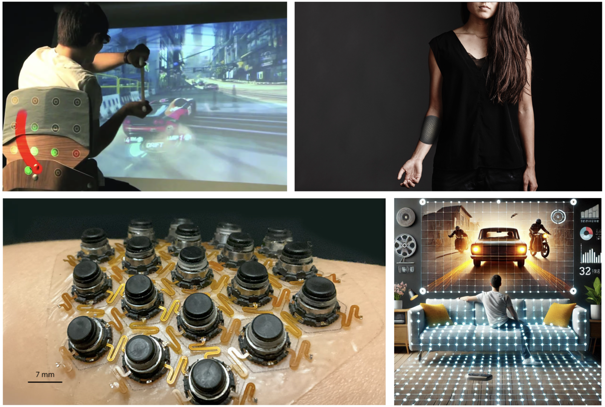
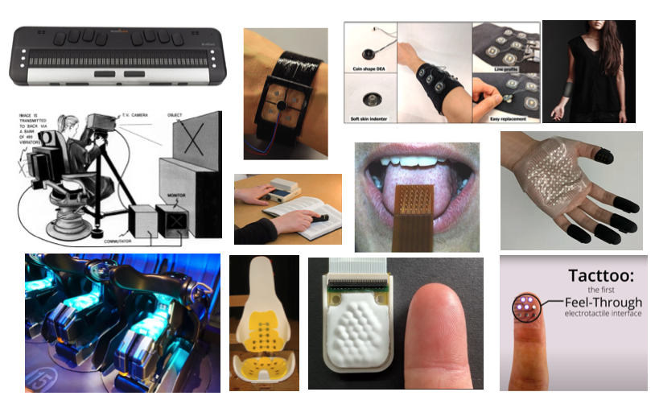
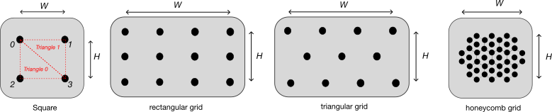
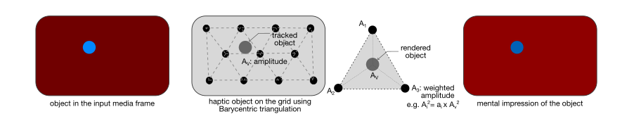
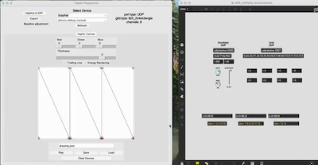
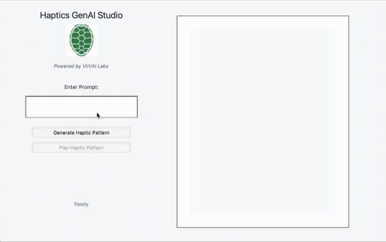

# ViiVai Milano: Grid Displays for media and communication
API and examples for Haptic Grid Displays

<figure>
  
  <figcaption>A variety of haptic grid displays for media and communication. </figcaption>
</figure>
<!-- 

 -->

## What are Haptic Grid Displays
Haptic Grid Displays are common in research and development settings, enabling the control of haptic content on the skin using multichannel haptic actuators arranged in spatial arrays. One advantage of grid displays is their ability to increase information transfer compared to a single actuator. Higher information throughput supports users to perform virtual tasks with greater efficiency. Another benefit of grid displays is the ability to provide structured spatial haptic feedback, correlating physical and media events to coherent haptic events, thus improving both immersion and causality with the virtual and/or augmented content in space.

<!-- 

 -->

<figure>
  
  <figcaption>Your image caption text goes here.</figcaption>
</figure>

Haptic Grid displays vary in sizes and forms, and have been used on fingertips, tongue, forearm, wrist, waist, torso, back, and almost all skin surfaces. The goal of these displays is to increase communication throughput by providing mentally correlated tactile messages for language communication, for navigation, to render spatially distributed interpersonal affective touch, or to render spatial surrounding content for games, movies, and immersive media.

## Nomenclature

Each channel of the multichannel haptic grid display is defined in [IEEE/IEEE_HapticHardware.py](IEEE/IEEE_HapticHardware.py). 

<figure>
  
  <figcaption>Types of grid layouts, (i) rectangular, (ii) triangular, (iii) hexagonal, or arbitrary </figcaption>
</figure>

### def setupHapticDictionary(device_type, border = SimpleNamespace(x, y, w, h)) -> device_dictionary
Set the Haptic Device Dictionary for a given device and grid frame

**device_type:** device types could be 'GrayPad' or '8ch_triangle'.\
**border:** frame border of the grid.\
**act_layout:** layout of the channels in the grid.\
**tri_layout:** triangular layout of the channels in the grid.

    device_dictionary = {
        'device_type': device_type,     # e.g. 'CR Milano Vibe'
        'grid_type': grid_type,         # e.g. '8ch_triangle'
        'grid_size': grid_size,         # e.g. (2,4) # 2 rows and 4 columns
        'device': device,               # e.g. 'GrayPad' or 'CR Milano Vibe'
        'location': location,           # e.g. 'back, seat'
        'channels': channels,
        'act_index': act_index,
        'g_index': g_index,
        'act_layout': act_layout,
        'tri_layout': tri_layout,
        'rect_layout': rect_layout,
        'physical_layout': physical_layout,
        'physical_layout_dim': physical_layout_dim, # e.g. Inch
        'frame border': border,         # e.g. default: pygame.Rect(0, 0, 200, 200)
        'range': hrange,                # e.g. (0,999), default: (0,1)
        'port': port,                   # e.g. 'Serial', default: 'UDP'
        'actuator_type': actuator_type,  # e.g. 'VCM'
        'actuator_size': actuator_size  # e.g. default: 30
    } 

### def barycentricEnergy(act, act_layout, tri_layout, player_dpos) -> result, act
Calculates the Barycentric coordinates of a point within the grid based on the energy estimation.

**act:** An np.array of dimension equal to the number of haptic channels in the grid.\
**act_layout:** layout of the channels in the grid.\
**tri_layout:** triangular layout of the channels in the grid.\
**player_dpos:** position of the point defined inside the grid.\
**result:** if the point is "Inside" or "Outside" the grid.

<figure>
  
  <figcaption>Your image caption text goes here.</figcaption>
</figure>

### def sendUDPamplitude(client, a)
Send UDP massage with act np.array over the client

### def setHapticOutput(act, g, act_index) -> act
Map haptic output to a physical grid

**act:** An np.array of dimension equal to the number of haptic channels in the grid.\
**g:** gain for each channel.\
**act_index:** index of each channel.

### def map_linearhaptics(value, minH, maxH, minI=0.0, maxI=1.0) -> value
Maps the value linearly from [minI,maxI] to [minH,maxH]

### class CR_RP2040W
A class for serial haptic grids defined in [IEEE/IEEE_CRHapticDriver.py](IEEE/IEEE_CRHapticDriver.py). Firmware implemented on RasphberryPi PicoW RP2040/RP2350

**Connents the Device:** 
    
    self.HapticDevice = CR_RP2040W(port='/dev/tty.usbmodem101')

**disconnect():** disconnects the serial device\
**reset():** resets the serial device\
**sendSerialStr(str):** send string via serial\
**DirectHaptics(act):** send act np.array via serial

## Example Code:
Run [IEEE/IEEE_Demo1.py](IEEE/IEEE_Demo1.py) to play the demo.

🎥 **Demo Video**  

<!-- [Click to watch the demo](images/IEEE_HapticDemo1.mp4) -->
<!--  -->

<!--  -->

## References:

### Color to Haptics Scheme

<!-- 
 -->

<!-- 
 -->

https://la.disneyresearch.com/wp-content/uploads/Cross-modal-Correspondence-between-Vibrations-and-Colors-Paper.pdf
